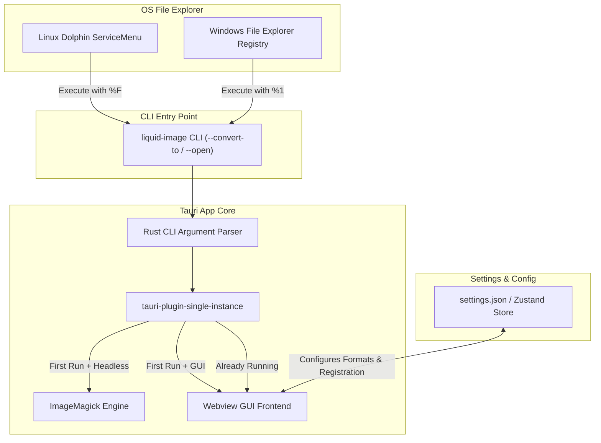

# Context Menu Integration & Quick Conversion Plan

This document outlines the design and implementation plan for integrating **Liquid Image** into file manager context menus (Linux KDE Dolphin / GNOME Nautilus / XFCE Thunar, and Windows File Explorer).

---

## 1. Overview & Key Objectives

The goal is to allow users to right-click image files directly in their OS file explorer (Dolphin on Linux, File Explorer on Windows) and:
1. **Quick Convert**: Convert selected images to target formats (e.g., WebP, PNG, JPEG, AVIF) in the background with desktop notifications.
2. **Open in App**: Open selected images directly in Liquid Image's GUI (Single or Batch Mode).
3. **GUI Configuration**: Allow users to toggle context menu integration and customize quick-convert formats in the Liquid Image Settings page.
4. **Single Instance Safety**: Ensure clicking multiple files or opening context menus multiple times doesn't spawn redundant app windows.

---

## 2. Component Architecture



---

## 3. Phase 1: GUI Settings Configuration

### 3.1 Settings State Expansion
Extend the frontend settings store (`src/features/settings/state/settings.store.ts`) and Tauri store backend (`settings.json`):
- `contextMenu.enabled`: boolean (default: `true`)
- `contextMenu.quickFormats`: `string[]` (default: `["webp", "png", "jpeg", "avif"]`)
- `contextMenu.outputBehavior`: `"same_dir"` | `"custom_dir"` (default: `"same_dir"`)
- `contextMenu.customOutputDir`: `string`
- `contextMenu.notifyOnComplete`: `boolean` (default: `true`)

### 3.2 GUI Settings UI
Add a dedicated **Context Menu** section in `SettingsPage.tsx`:
- Toggle switch: **Enable OS File Manager Context Menu Integration**
- Multi-select format tags: Select which formats appear in the quick convert submenu.
- Button: **Register / Re-install ServiceMenu** (Linux) / **Register Windows Shell Menu** (Windows).
- Status indicator showing whether context menu integration is active.

---

## 4. Phase 2: Rust Backend CLI Argument Parsing

### 4.1 Dependency Addition
Add `clap` to `src-tauri/Cargo.toml`:
```toml
[dependencies]
clap = { version = "4", features = ["derive"] }
```

### 4.2 CLI Argument Definition
Define CLI options in `src-tauri/src/cli.rs`:
```rust
use clap::Parser;

#[derive(Parser, Debug, Clone)]
#[command(name = "liquid-image", author, version, about = "Batch Image Converter")]
pub struct CliArgs {
    /// Files or directories to process
    pub files: Vec<String>,

    /// Convert input files directly to specified format without opening GUI
    #[arg(short = 'c', long = "convert-to")]
    pub convert_to: Option<String>,

    /// Custom output directory for conversion
    #[arg(short = 'o', long = "output")]
    pub output: Option<String>,

    /// Force opening in GUI mode
    #[arg(long = "open")]
    pub open: bool,

    /// Run in headless mode (no window created)
    #[arg(long = "headless")]
    pub headless: bool,
}
```

### 4.3 Headless Execution vs. Webview Window Spawning
In `src-tauri/src/main.rs` / `lib.rs`:
- If `--convert-to <FORMAT>` is specified alongside `--headless`:
  1. Skip creating the webview window (`visible: false` or do not open `main` window).
  2. Execute `magick::service::run_batch` in Rust asynchronously.
  3. Send system notification via OS notification API when done.
  4. Exit process cleanly.
- If `--open` or no conversion flag is provided:
  1. Launch webview window as normal.
  2. Emit Tauri event `app:open-files` to Frontend with the list of file paths.

---

## 5. Phase 3: Single Instance Handling

### 5.1 Dependency Addition
Add `tauri-plugin-single-instance` to `src-tauri/Cargo.toml`:
```toml
[dependencies]
tauri-plugin-single-instance = "2"
```

### 5.2 Tauri Single Instance Setup
In `src-tauri/src/lib.rs`:
```rust
.plugin(tauri_plugin_single_instance::init(|app, args, _cwd| {
    // Second instance launched! Pass CLI args to existing instance.
    let parsed_args = CliArgs::parse_from(args);
    if let Some(format) = parsed_args.convert_to {
        // Trigger background conversion on main instance
    } else {
        // Focus existing window and load files
        if let Some(window) = app.get_webview_window("main") {
            let _ = window.show();
            let _ = window.set_focus();
            let _ = window.emit("app:open-files", parsed_args.files);
        }
    }
}))
```

---

## 6. Phase 4: Linux KDE Dolphin Integration

### 6.1 Dolphin ServiceMenu Specification (`.desktop`)
Template file: `src-tauri/assets/linux/liquid-image-servicemenu.desktop`

```ini
[Desktop Entry]
Type=Service
ServiceTypes=KonqPopupMenu/Plugin
MimeType=image/jpeg;image/png;image/webp;image/avif;image/gif;image/tiff;image/bmp;image/svg+xml;
Actions=ConvertWebp;ConvertPng;ConvertJpeg;ConvertAvif;OpenInApp;
X-KDE-Submenu=Convert with Liquid Image
X-KDE-Priority=TopLevel

[Desktop Action ConvertWebp]
Name=Convert to WebP
Icon=image-x-generic
Exec=liquid-image --headless --convert-to webp %F

[Desktop Action ConvertPng]
Name=Convert to PNG
Icon=image-x-generic
Exec=liquid-image --headless --convert-to png %F

[Desktop Action ConvertJpeg]
Name=Convert to JPEG
Icon=image-x-generic
Exec=liquid-image --headless --convert-to jpeg %F

[Desktop Action ConvertAvif]
Name=Convert to AVIF
Icon=image-x-generic
Exec=liquid-image --headless --convert-to avif %F

[Desktop Action OpenInApp]
Name=Open in Liquid Image GUI...
Icon=liquid-image
Exec=liquid-image --open %F
```

### 6.2 Installation Targets & Paths
- **User Installation**: `~/.local/share/kservices6/ServiceMenus/` (KDE Plasma 6) or `~/.local/share/kservices5/ServiceMenus/` (KDE Plasma 5).
- **System-wide Installation (PKGBUILD / Flatpak / AppImage)**: `/usr/share/kservices6/ServiceMenus/`.
- **Runtime Registration**: Rust backend helper command `magick::service::register_dolphin_servicemenu()` to generate/update `.desktop` files based on user settings in GUI.

---

## 7. Phase 5: Windows File Explorer Version Plan (Late Phase)

### 7.1 Classic Shell Registry Integration (Windows 10 / Windows 11 "Show More Options")
Registry entry structure under `HKCU\Software\Classes\SystemFileAssociations\image\shell`:

1. **Main Cascading Context Menu Entry**:
   - Key: `HKCU\Software\Classes\SystemFileAssociations\image\shell\LiquidImage`
   - Values:
     - `MUIVerb` = `"Liquid Image Converter"`
     - `SubCommands` = `""`
     - `Icon` = `"C:\Program Files\liquid-image\liquid-image.exe,0"`

2. **Subcommands Registry Entries**:
   - `HKCU\Software\Classes\SystemFileAssociations\image\shell\LiquidImage\shell\ConvertWebP`
     - `MUIVerb` = `"Convert to WebP"`
     - `command` key = `"C:\Program Files\liquid-image\liquid-image.exe" --headless --convert-to webp "%1"`
   - `HKCU\Software\Classes\SystemFileAssociations\image\shell\LiquidImage\shell\ConvertPNG`
     - `MUIVerb` = `"Convert to PNG"`
     - `command` key = `"C:\Program Files\liquid-image\liquid-image.exe" --headless --convert-to png "%1"`

### 7.2 Modern Windows 11 Context Menu Plan
Windows 11 hides classic registry shell menus under "Show More Options" unless a modern Sparse Package / Shell Extension ID is registered:
- **Approach A (Recommended)**: MSIX / Sparse Package App Manifest registration with `desktop5:ItemContextMenu`.
- **Approach B**: Helper Rust library using `winreg` crate to automate HKCU registry key creation/removal during app settings toggle or installer execution.

---

## 8. Implementation Roadmap & Milestones

| Milestone | Tasks | Est. Scope |
| :--- | :--- | :--- |
| **Milestone 1: Backend CLI & Headless Pipeline** | Add `clap`, implement `--convert-to`, `--open`, `--headless` flags in Rust | 2-3 Days |
| **Milestone 2: Single Instance Handling** | Integrate `tauri-plugin-single-instance`, route IPC events to frontend | 1-2 Days |
| **Milestone 3: Linux Dolphin ServiceMenu** | Create ServiceMenu `.desktop` templates, PKGBUILD integration, GUI install script | 1-2 Days |
| **Milestone 4: GUI Settings Integration** | Add Context Menu settings section, dynamic ServiceMenu regeneration | 2 Days |
| **Milestone 5: Windows Explorer Version** | Implement `winreg` registry management, Windows 11 cascading shell integration | 3-4 Days |
