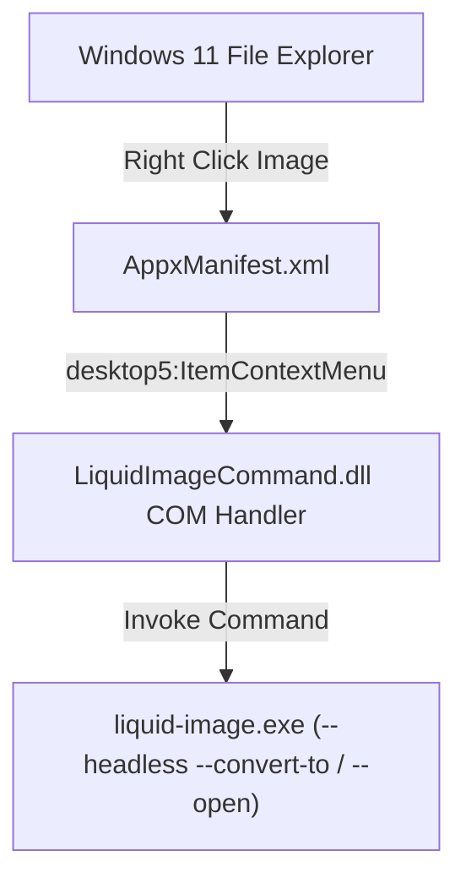

# Windows 11 Modern Context Menu (Sparse Package) Guide

This document describes how to enable **Top-Level (Tầng 1) Modern Windows 11 Context Menu** integration for **Liquid Image** using Microsoft's **Sparse Package (AppxManifest)** technology.

---

## 1. Background: Windows 11 Context Menu Architecture

On Windows 11, Microsoft redesigned File Explorer's right-click context menu:
1. **Top-Level Menu (Tầng 1)**: Only accepts modern shell extensions implementing the `IExplorerCommand` COM interface, registered via an MSIX or **Sparse Package with Identity**.
2. **Classic Menu (Show More Options / Shift + F10)**: Displays legacy Win32 Registry associations (`HKEY_CURRENT_USER\Software\Classes\SystemFileAssociations\...`).

To promote **Liquid Image** to the modern top-level menu directly (without user clicking "Show more options"), Windows 11 uses a **Sparse Package**.

---

## 2. Sparse Package Architecture

A Sparse Package allows a traditional unpackaged Win32 application (`liquid-image.exe`) to declare modern Windows 10/11 extensibility points while remaining in its standard install directory.



### Key Elements in `AppxManifest.xml`
The configuration file is located at [src-tauri/assets/windows/AppxManifest.xml](file:///home/weback/Documents/source/liquid-image/src-tauri/assets/windows/AppxManifest.xml):

- **Package Identity**: Provides a recognized identity (`vn.io.weback1609.liquid-image`).
- **External Location Flag**: `<uap10:AllowExternalContent>true</uap10:AllowExternalContent>` specifies that application binaries reside outside the WindowsApps directory.
- **Modern Context Menu Extension**:
  ```xml
  <desktop4:FileExplorerContextMenus>
    <desktop4:ItemType Type="SystemFileAssociations\image">
      <desktop5:ItemContextMenu Id="LiquidImage.ImageContext" MultiSelectModel="Player">
        <desktop5:Verb Id="ConvertWithLiquidImage" Clsid="{D17117C3-8991-44B7-B597-9BC785BD98E1}" />
      </desktop5:ItemContextMenu>
    </desktop4:ItemType>

    <desktop4:ItemType Type="SystemFileAssociations\.webp">
      <desktop5:ItemContextMenu Id="LiquidImage.WebpContext" MultiSelectModel="Player">
        <desktop5:Verb Id="ConvertWebpWithLiquidImage" Clsid="{D17117C3-8991-44B7-B597-9BC785BD98E1}" />
      </desktop5:ItemContextMenu>
    </desktop4:ItemType>
  </desktop4:FileExplorerContextMenus>
  ```
- **COM Server Declaration**:
  ```xml
  <com:Extension Category="windows.comServer">
    <com:ComServer>
      <com:SurrogateServer DisplayName="Liquid Image Context Menu Handler">
        <com:Class
          Id="D17117C3-8991-44B7-B597-9BC785BD98E1"
          Path="LiquidImageCommand.dll"
          ThreadingModel="STA" />
      </com:SurrogateServer>
    </com:ComServer>
  </com:Extension>
  ```

---

## 3. Registration and Deployment

### 3.1 Registration Command (PowerShell)
To register the Sparse Package on a Windows 11 machine:
```powershell
powershell -ExecutionPolicy Bypass -File src-tauri/assets/windows/register-sparse-package.ps1
```
Or directly:
```powershell
Add-AppxPackage -Register "C:\Path\To\LiquidImage\AppxManifest.xml" -AllowExternalLocation
```

### 3.2 Unregistration Command (PowerShell)
```powershell
powershell -ExecutionPolicy Bypass -File src-tauri/assets/windows/unregister-sparse-package.ps1
```
Or directly:
```powershell
Get-AppxPackage -Name "vn.io.weback1609.liquid-image" | Remove-AppxPackage
```

---

## 4. Dual-Mode Strategy (Recommended)

1. **Registry Integration (HKCU)**:
   - Already fully implemented in [src-tauri/src/desktop_integration.rs](file:///home/weback/Documents/source/liquid-image/src-tauri/src/desktop_integration.rs).
   - Works immediately on Windows 10 (top-level) and Windows 11 (under "Show more options").
   - Requires zero code signing certificates and zero DLLs.
2. **Sparse Package Integration (Windows 11 Modern)**:
   - Available via [src-tauri/assets/windows/AppxManifest.xml](file:///home/weback/Documents/source/liquid-image/src-tauri/assets/windows/AppxManifest.xml).
   - Promotes the action to Windows 11 top-level menu.
