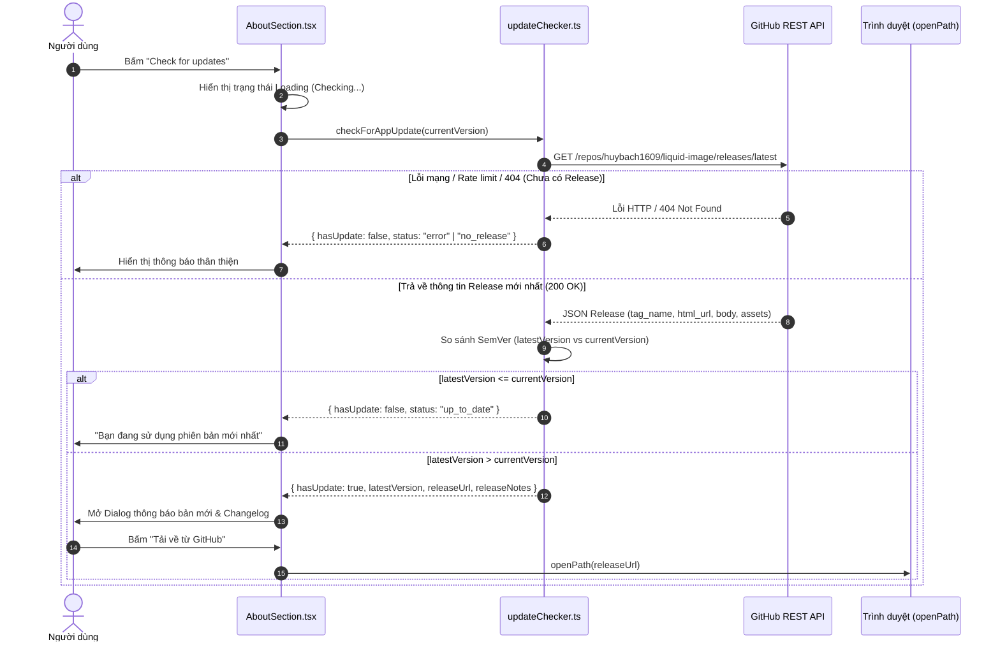

# Kế hoạch triển khai Kiểm tra cập nhật qua GitHub Releases (GitHub Releases Update Plan)

Tài liệu này chi tiết hóa toàn bộ các bước triển khai tính năng **Kiểm tra cập nhật (Check for Updates)** thông qua **GitHub Releases API** cho ứng dụng **Liquid Image** (`huybach1609/liquid-image`), kết hợp luồng tự động hóa CI/CD đóng gói ứng dụng bằng GitHub Actions.

---

## 1. Tổng quan & Luồng hoạt động (Architecture & Flow)

### 1.1. Luồng kiểm tra phiên bản (Sequence Flow)



---

## 2. Danh sách công việc chi tiết (Task Checklist)

### Giai đoạn 1: Thiết lập CI/CD đóng gói tự động trên GitHub Actions

- [x] **1.1. Tạo file workflow `.github/workflows/release.yml`**:
  - [x] Thiết lập trigger sự kiện: `on: push: tags: ['v*']`.
  - [x] Cấu hình matrix đa nền tảng:
    - `ubuntu-22.04` (Build gói Linux: `.AppImage`, `.deb`).
    - `windows-latest` (Build gói Windows: `.msi`, `.exe`).
  - [x] Cài đặt môi trường build:
    - Setup Bun runtime (`oven-sh/setup-bun@v2`).
    - Setup Rust toolchain stable (`dtolnay/rust-toolchain@stable`).
    - Cài đặt thư viện hệ thống Linux: `libwebkit2gtk-4.1-dev`, `libappindicator3-dev`, `librsvg2-dev`, `patchelf`, `libasound2-dev`.
  - [x] Cấu hình tích hợp sidecar ImageMagick:
    - Đảm bảo các file `src-tauri/binaries/magick-*` được nhận diện đúng mục tiêu kiến trúc khi đóng gói (`x86_64-unknown-linux-gnu` và `x86_64-pc-windows-msvc`).
  - [x] Sử dụng action chính thức `tauri-apps/tauri-action@v0`:
    - Cung cấp `GITHUB_TOKEN` để tự động tạo GitHub Release.
    - Tự động đính kèm tất cả file cài đặt (`.AppImage`, `.deb`, `.msi`, `.exe`) vào bản Release.

---

### Giai đoạn 2: Xây dựng Module kiểm tra cập nhật (Frontend Update Service)

- [x] **2.1. Tạo module `src/shared/services/updateChecker.ts`**:
  - [x] Định nghĩa interface chuẩn:
    ```ts
    export interface GitHubRelease {
      tag_name: string;
      name: string;
      html_url: string;
      body: string;
      published_at: string;
      prerelease: boolean;
    }

    export interface UpdateCheckResult {
      status: "up_to_date" | "update_available" | "no_releases" | "error";
      currentVersion: string;
      latestVersion?: string;
      releaseName?: string;
      releaseUrl?: string;
      releaseNotes?: string;
      publishedAt?: string;
      errorMessage?: string;
    }
    ```
  - [x] Hàm so sánh phiên bản `compareSemver(v1: string, v2: string): number`:
    - Tự động chuẩn hóa (loại bỏ tiền tố `v`).
    - Tách các thành phần `[major, minor, patch]`.
    - Trả về `1` nếu `v1 > v2`, `-1` nếu `v1 < v2`, `0` nếu bằng nhau.
  - [x] Hàm `checkForAppUpdate(currentVersion: string): Promise<UpdateCheckResult>`:
    - Gọi API: `https://api.github.com/repos/huybach1609/liquid-image/releases/latest`.
    - Thêm headers tiêu chuẩn: `Accept: application/vnd.github.v3+json`.
    - Xử lý mã HTTP 404 (chưa có release nào trên repo).
    - Xử lý mã HTTP 403 (vượt rate-limit GitHub API ẩn danh 60 req/giờ).
    - Bắt lỗi ngoại lệ mạng (offline / DNS failed).

- [x] **2.2. Viết Unit Test cho Service (`src/shared/services/__tests__/updateChecker.test.ts`)**:
  - [x] Test hàm `compareSemver`:
    - `0.2.0` vs `0.1.0` -> `1`
    - `0.1.0` vs `0.1.0` -> `0`
    - `0.1.0` vs `0.1.1` -> `-1`
    - Có tiền tố `v`: `v1.0.0` vs `0.9.9` -> `1`
    - Xử lý pre-release tags (`0.2.0-beta.1`).
  - [x] Test `checkForAppUpdate` với mock fetch:
    - Mock HTTP 200 trả về bản mới hơn -> Trạng thái `update_available`.
    - Mock HTTP 200 trả về bản bằng hoặc cũ hơn -> Trạng thái `up_to_date`.
    - Mock HTTP 404 -> Trạng thái `no_releases`.
    - Mock HTTP 403 -> Trạng thái `error` rate-limit.
    - Mock lỗi kết nối mạng -> Trạng thái `error`.

---

### Giai đoạn 3: Cập nhật giao diện & Tích hợp Dialog (`AboutSection.tsx`)

- [x] **3.1. Thiết kế Component `UpdateDialog.tsx` (hoặc tích hợp trực tiếp vào `AboutSection.tsx`)**:
  - [x] Hiển thị Dialog / Modal khi tìm thấy bản cập nhật mới:
    - Tiêu đề: *"Đã có phiên bản mới!"* kèm badge version mới (ví dụ: `v0.2.0`).
    - Thông tin so sánh: `v0.1.0` ➔ `v0.2.0`.
    - Vùng cuộn (ScrollArea) hiển thị nội dung Release Notes (Changelog) định dạng Markdown / Plaintext.
    - Nút hành động:
      - Nút *"Để sau"* (Đóng modal).
      - Nút *"Tải về bản mới"* (mở trình duyệt qua `openPath(releaseUrl)`).
- [x] **3.2. Cập nhật nút "Check for updates" trong `AboutSection.tsx`**:
  - [x] Thay thế `setTimeout` giả lập hiện tại bằng hàm `checkForAppUpdate(appVersion)`.
  - [x] Trạng thái Loading: Nút bị disable, icon `Loader2` xoay vòng kèm nhãn `"Checking..."`.
  - [x] Trạng thái khi không có bản mới: Hiển thị tooltip hoặc thông báo inline xanh lá *"Bạn đang dùng phiên bản mới nhất"* tự động ẩn sau 4 giây.
  - [x] Trạng thái khi lỗi kết nối / 404: Hiển thị thông báo màu hổ phách/đỏ rõ ràng.

---

### Giai đoạn 4: Bản địa hóa đa ngôn ngữ (i18n)

- [x] **4.1. Bổ sung từ khóa vào `src/locales/en/settings.json`**:
  ```json
  "about": {
    "update": {
      "checking": "Checking for updates...",
      "upToDate": "You are using the latest version",
      "available": "New version available: v{{version}}",
      "noReleases": "No official releases found on GitHub yet",
      "error": "Failed to check for updates. Check your internet connection.",
      "dialogTitle": "Software Update Available",
      "current": "Current version",
      "latest": "Latest version",
      "changelog": "Release Notes",
      "downloadAction": "Download from GitHub",
      "laterAction": "Remind Me Later"
    }
  }
  ```
- [x] **4.2. Bổ sung từ khóa vào `src/locales/vi/settings.json`**:
  ```json
  "about": {
    "update": {
      "checking": "Đang kiểm tra bản cập nhật...",
      "upToDate": "Bạn đang sử dụng phiên bản mới nhất",
      "available": "Đã có bản cập nhật mới: v{{version}}",
      "noReleases": "Chưa có bản phát hành chính thức nào trên GitHub",
      "error": "Không thể kiểm tra cập nhật. Vui lòng kiểm tra kết nối mạng.",
      "dialogTitle": "Có bản cập nhật mới",
      "current": "Phiên bản hiện tại",
      "latest": "Phiên bản mới nhất",
      "changelog": "Thông tin phát hành & Thay đổi",
      "downloadAction": "Tải về từ GitHub",
      "laterAction": "Để sau"
    }
  }
  ```

---

## 3. Quy trình phát hành bản cập nhật (Release Runbook)

Khi mọi công việc trên hoàn tất, quy trình phát hành một phiên bản mới sẽ diễn ra như sau:

```bash
# 1. Tăng version đồng bộ cho dự án (package.json + Cargo.toml + tauri.conf.json)
bun run bump patch   # hoặc: bun run bump minor

# 2. Tạo commit và gắn tag git
git commit -am "chore: release v0.1.1"
git tag v0.1.1

# 3. Đẩy lên GitHub để kích hoạt CI/CD
git push origin main --tags
```

👉 **Kết quả mong đợi**:
1. GitHub Actions biên dịch bản phát hành và tạo Release `v0.1.1` kèm các file `.AppImage`, `.deb`, `.exe`, `.msi`.
2. Mọi người dùng đang chạy bản `v0.1.0` khi bấm nút **"Check for updates"** trong ứng dụng sẽ ngay lập tức nhìn thấy thông báo bản `v0.1.1` cùng nút tải về.
