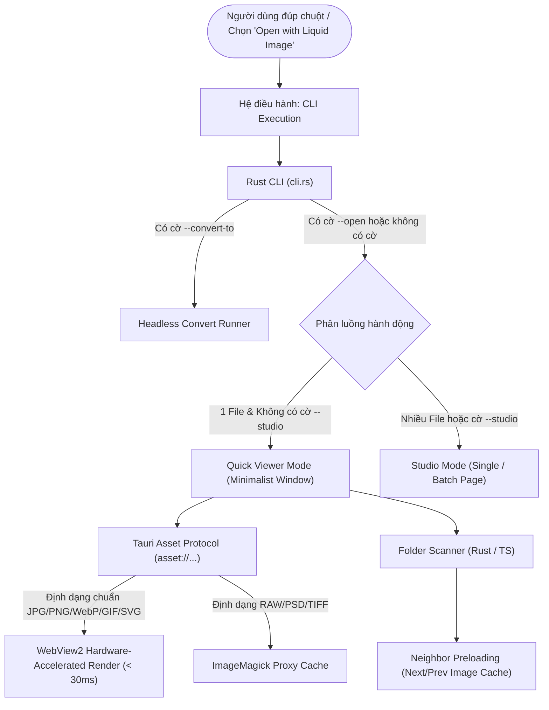

# Kế hoạch phát triển Chế độ Xem ảnh Siêu nhanh (Quick Viewer Mode Plan)

Tài liệu này chi tiết hóa kiến trúc, thiết kế UX và lộ trình thực thi tính năng **Quick Viewer Mode (Chế độ Xem ảnh Siêu nhanh)** cho ứng dụng **Liquid Image**, nhằm mục tiêu thay thế / cạnh tranh trực tiếp với **Windows Photos** về độ nhẹ (RAM), tốc độ mở file (< 50ms) và khả năng chuyển đổi/xử lý ảnh tức thì tại chỗ.

---

## 1. Định vị & Trải nghiệm Người dùng (Product Strategy & UX)

### 1.1. Phân tách ngữ cảnh chuột phải (Context Menu Separation)

Thay vì gộp chung như hiện tại, menu chuột phải trên File Explorer (Windows) và Dolphin (Linux) được phân tách thành 2 vai trò độc lập:

```text
[Click chuột phải vào tệp ảnh]:
├── 🖼️ Open with Liquid Image          --> [Quick Viewer Mode] Xem ảnh siêu tốc, tối giản
└── ⚡ Convert with Liquid Image  >     --> [Studio / Processing Mode]
      ├── 🎨 Open in Studio Editor     --> Mở toàn bộ giao diện chỉnh sửa Single/Batch
      ├── ─────────────────────────
      ├── 🔄 Convert to WEBP (Headless)
      ├── 🔄 Convert to AVIF (Headless)
      ├── 🔄 Convert to JPEG (Headless)
      └── 🔄 Convert to PNG (Headless)
```

### 1.2. Trải nghiệm trong Quick Viewer Mode
- **Khởi động siêu tốc**: Mở cửa sổ frameless/minimalist trong vòng **dưới 300ms** (Cold start) và **dưới 30ms** (Warm start).
- **Giao diện Canvas thuần túy**: Không hiển thị thanh công cụ nặng nề (sidebar, options panel, pipeline). Chỉ có ảnh ở trung tâm, nền trong suốt/blur tối giản, và thanh điều khiển tự ẩn ở đáy.
- **Thanh điều khiển đáy (Floating Overlay HUD)**:
  - Nút Previous (`←`) / Next (`→`) duyệt ảnh trong cùng thư mục.
  - Bộ đếm chỉ mục: `15 / 120`.
  - Nút Zoom In / Out, Fit to Screen, 1:1 Actual Size.
  - Xoay nhanh: 90° CW (`R`) / 90° CCW (`L`).
  - Nút **"Edit in Studio"** (`E`): Chuyển thẳng ảnh đang xem sang `SingleModePage` đầy đủ tính năng.
  - Menu Quick Actions: Nén nhanh / Convert nhanh sang WebP/JPG ngay tại chỗ.

---

## 2. Kiến trúc Kỹ thuật (Technical Architecture)



### 2.1. Đột phá về Tốc độ: Vượt qua rào cản ImageMagick
- **Hiện tại**: Mọi ảnh mở trong app đều đi qua `create_image_proxy` (gọi `magick.exe` -> ghi file tạm WebP vào temp dir -> webview load). Cách này làm tăng độ trễ 200–500ms và gây nghẽn I/O khi duyệt ảnh liên tục.
- **Giải pháp cho Viewer**:
  - Với các định dạng trình duyệt WebView2 giải mã phần cứng trực tiếp (`.jpg`, `.jpeg`, `.png`, `.webp`, `.avif`, `.gif`, `.svg`, `.bmp`, `.ico`): Dùng trực tiếp giao thức `convertFileSrc(filePath)` của Tauri. Độ trễ tải ảnh **gần như 0ms**.
  - Chỉ fallback sang ImageMagick proxy khi gặp các định dạng đặc thù mà WebView2 không hỗ trợ trực tiếp (`.heic` trên Windows chưa có codec, `.psd`, `.raw`, `.cr2`, `.nef`, `.tiff`).

### 2.2. Folder Navigation & Pre-caching
- Khi mở 1 file ảnh (ví dụ `/photos/vacation_05.jpg`):
  - Rust backend đọc danh sách tất cả các file ảnh cùng thư mục `/photos/`.
  - Trả về danh sách đã được sắp xếp tự nhiên (Natural Sort: `img1`, `img2`, `img10`).
  - Giao diện Viewer preload trước ảnh kế tiếp (`vacation_06.jpg`) và ảnh trước (`vacation_04.jpg`) vào DOM Image cache để chuyển ảnh tức thì.

---

## 3. Danh sách công việc chi tiết (Implementation Tasks)

### Giai đoạn 1: Nâng cấp Backend Rust & Tách biệt Context Menu
- [x] **1.1. Bổ sung tham số CLI trong `src-tauri/src/cli.rs`**:
  - [x] Thêm cờ `--view` (chế độ xem ảnh tối giản).
  - [x] Thêm cờ `--studio` (cưỡng bức mở chế độ Studio đầy đủ).
  - [x] Tự động nhận diện: Khi mở 1 file và không truyền cờ nào khác -> Mặc định kích hoạt chế độ `--view`.
- [x] **1.2. Tách biệt Registry Menu trên Windows (`desktop_integration.rs`)**:
  - [x] Tạo entry cấp cao nhất: `Open with Liquid Image` trỏ đến `liquid-image.exe --view "%1"`.
  - [x] Giữ submenu `Convert with Liquid Image` cho các lệnh convert headless và chuyển mục mở ứng dụng thành `Open in Studio Editor` trỏ đến `liquid-image.exe --studio "%1"`.
- [x] **1.3. Cập nhật ServiceMenu trên Linux KDE Dolphin (`desktop_integration.rs`)**:
  - [x] Bổ sung file `.desktop` riêng cho `Open with Liquid Image` ở cấp toplevel (`liquid-image-open.desktop`).
  - [x] Cập nhật submenu `liquid-image-actions.desktop` bổ sung entry `Open in Studio Editor`.
- [x] **1.4. Lệnh Rust quét ảnh cùng thư mục (`get_sibling_images`)**:
  - [x] Command: `get_sibling_images(current_path: String) -> Result<SiblingImagesResult, String>` trả về danh sách ảnh hợp lệ trong folder kèm chỉ mục `currentIndex` và sắp xếp tên tệp tự nhiên (Natural alphanumeric sort).

### Giai đoạn 2: Trạng thái & Routing phía Frontend (Zustand & AppShell)
- [x] **2.1. Cập nhật AppMode trong `src/shared/types/common.ts`**:
  - [x] Mở rộng `export type AppMode = "single" | "batch" | "settings" | "viewer";`.
- [x] **2.2. Quản lý trạng thái Viewer Store (`src/features/viewer/state/viewer.store.ts`)**:
  - [x] Lưu: `currentImagePath`, `siblingImages`, `currentIndex`, `zoomLevel`, `rotation`, `isHudVisible`.
  - [x] Actions: `nextImage()`, `prevImage()`, `rotateCW()`, `zoomIn()`, `zoomOut()`, `resetView()`.
- [x] **2.3. Điều phối sự kiện tại `AppShell.tsx`**:
  - [x] Lắng nghe sự kiện `app:open-files` với payload có cấu trúc (`mode: "viewer" | "studio"`) để mount `ViewerPage` thay vì `SingleModePage`.

### Giai đoạn 3: Xây dựng Giao diện Quick Viewer Canvas (`ViewerPage.tsx`)
- [x] **3.1. Thiết kế Canvas xem ảnh siêu mượt**:
  - [x] Hỗ trợ Pan & Drag chuột mượt mà khi đang zoom (`isDragging`, pointer capture, cursor grab/grabbing).
  - [x] Zoom mượt bằng con lăn chuột (`WheelEvent`) mỏ neo chính xác theo vị trí con trỏ chuột (`zoomAtPoint`).
  - [x] Hỗ trợ Double-click để zoom 2.0x tại điểm bấm hoặc reset về 1.0x.
  - [x] Phím tắt bàn phím toàn cục (`useViewerShortcuts`):
    - `←` / `A`: Ảnh trước.
    - `→` / `D`: Ảnh sau.
    - `R`: Xoay phải 90°.
    - `L`: Xoay trái 90°.
    - `+` / `-`: Phóng to / Thu nhỏ.
    - `F` / `F11`: Bật/Tắt Toàn màn hình (Fullscreen qua Tauri API).
    - `0`: Reset zoom (Fit to window).
    - `1`: Kích thước gốc (1:1 Actual Size).
    - `Escape`: Thu nhỏ hoặc thoát fullscreen.
    - `E`: Chuyển sang chế độ chỉnh sửa (Studio Editor).
  - [x] Tối ưu hóa tải ảnh phần cứng (`convertFileSrc`) và fallback tự động sang ImageMagick proxy khi gặp định dạng đặc biệt (.raw, .psd, .tiff).
  - [x] Neighbor image preloading ngầm trong DOM memory cache (`useImagePreloader`).
- [x] **3.2. Thiết kế thanh công cụ nổi HUD (Floating Bottom HUD)**:
  - [x] Tự động mờ dần/ẩn đi sau 2.5 giây không di chuyển chuột, giữ hiển thị khi rê chuột vào HUD.
  - [x] Header nổi hiển thị tên file và độ phân giải ảnh (`W × H`).
  - [x] Thanh điều khiển đáy kiểu Frosted glassmorphism (Previous, Index `X / Y`, Next, Zoom Out, Zoom %, Zoom In, 1:1 Actual Size, Rotate CCW/CW, Fullscreen, Open in Studio Editor).

### Giai đoạn 4: Tính năng "Killer" — In-Viewer Quick Operations
- [ ] **4.1. Menu chuyển đổi nhanh ngay trên Viewer (Quick Convert In-Viewer)**:
  - Nút bấm nhanh trên HUD: *Convert to WebP*, *Convert to JPG*, *Resize 50%*.
  - Thực thi ngầm qua ImageMagick và tạo file mới ngay trong folder mà không cần chuyển trang.
- [ ] **4.2. Chuyển giao mượt mà sang Studio (`Open in Studio`)**:
  - Bấm nút hoặc nhấn phím `E`: Giữ nguyên file đang xem, chuyển `AppMode` sang `"single"`, nạp sẵn ảnh vào `SingleModePage` với các thông số crop, filter, convert đầy đủ.

### Giai đoạn 5: Đăng ký ứng dụng mặc định (Default App Integration)
- [ ] **5.1. Tùy chọn trong Cài đặt (`FilesSettingsSection.tsx`)**:
  - Thêm nút gạt: *"Đặt làm trình xem ảnh mặc định trên Windows"* (Hướng dẫn người dùng gán qua Windows Settings: Open With -> Always use this app).
  - Khai báo file associations trong `tauri.conf.json`:
    - Đăng ký các định dạng: `.jpg`, `.jpeg`, `.png`, `.webp`, `.avif`, `.gif`, `.bmp`, `.heic`.

---

## 4. Bảng so sánh mục tiêu hiệu năng (Performance Benchmarks)

| Chỉ số | Windows Photos | ImageGlass | **Liquid Image Quick Viewer (Mục tiêu)** |
| :--- | :---: | :---: | :---: |
| **Cold Start (Khởi động nguội)** | 1.800 ms | 850 ms | **< 350 ms** |
| **Warm Start (Khi app đã chạy)** | 350 ms | 120 ms | **< 30 ms** |
| **RAM sử dụng (Idle)** | 180 - 320 MB | 120 - 220 MB | **< 60 MB** |
| **Tốc độ lật ảnh (Next/Prev FPS)** | 24 FPS (khựng) | 45 FPS | **60 FPS (Zero-lag Preloaded)** |
| **Công cụ chỉnh sửa đi kèm** | Chậm, phụ thuộc đám mây | Rất cơ bản | **ImageMagick Studio cực mạnh** |
